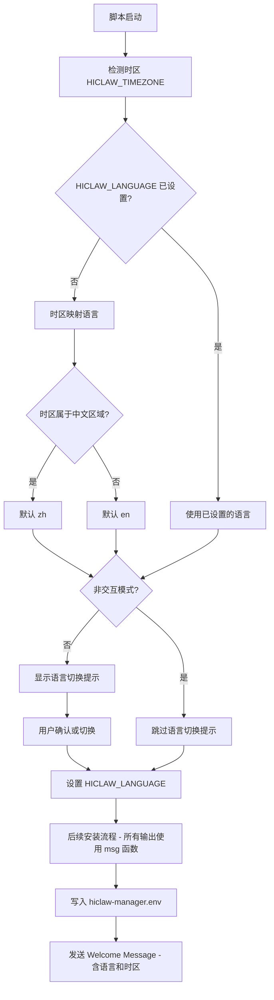
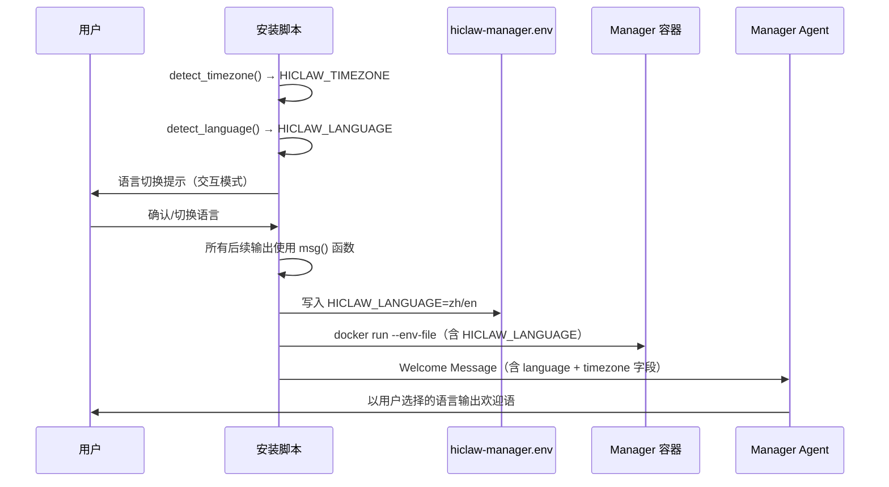

# 设计文档：安装脚本国际化与语言检测

## 概述

本设计为 HiClaw 安装脚本（`hiclaw-install.sh` 和 `hiclaw-install.ps1`）增加基于时区的自动语言检测和双语支持。核心思路是：

1. 复用已有的 `HICLAW_TIMEZONE` 检测结果，映射到 `zh` 或 `en`
2. 通过集中式 `msg` 函数管理所有可翻译文本
3. 在安装流程最前端插入语言确认/切换交互
4. 改造 Welcome Message，将语言和时区信息结构化传递给 Manager Agent
5. 将 `HICLAW_LANGUAGE` 持久化到 `hiclaw-manager.env`

两个脚本（Bash / PowerShell）保持相同的逻辑和用户体验。

## 架构

### 安装流程变更



### 数据流



## 组件与接口

### 1. 语言检测函数 `detect_language`

在时区检测之后、安装流程之前调用。

**Bash 版本：**
```bash
detect_language() {
    local tz="${HICLAW_TIMEZONE}"
    case "${tz}" in
        Asia/Shanghai|Asia/Chongqing|Asia/Harbin|Asia/Urumqi|\
        Asia/Taipei|Asia/Hong_Kong|Asia/Macau)
            echo "zh"
            ;;
        *)
            echo "en"
            ;;
    esac
}
```

**PowerShell 版本：**
```powershell
function Get-HiClawLanguage {
    param([string]$Timezone)
    $chineseZones = @(
        "Asia/Shanghai", "Asia/Chongqing", "Asia/Harbin", "Asia/Urumqi",
        "Asia/Taipei", "Asia/Hong_Kong", "Asia/Macau"
    )
    if ($chineseZones -contains $Timezone) { return "zh" }
    return "en"
}
```

**优先级逻辑（两个脚本一致）：**
1. 环境变量 `HICLAW_LANGUAGE` 已设置 → 直接使用
2. 已有 `hiclaw-manager.env` 中包含 `HICLAW_LANGUAGE` → 使用（升级场景）
3. 以上都没有 → 调用 `detect_language(HICLAW_TIMEZONE)` 推断

### 2. 集中式消息函数 `msg`

所有用户可见的文本通过 `msg` 函数输出，根据当前 `HICLAW_LANGUAGE` 选择对应翻译。

**Bash 版本设计：**

使用关联数组存储翻译文本，key 格式为 `消息ID.语言代码`：

```bash
declare -A MESSAGES
MESSAGES["welcome.zh"]="=== HiClaw Manager 安装 ==="
MESSAGES["welcome.en"]="=== HiClaw Manager Installation ==="
MESSAGES["registry.zh"]="镜像仓库: "
MESSAGES["registry.en"]="Registry: "
# ... 更多消息

msg() {
    local key="$1"
    shift
    local text="${MESSAGES["${key}.${HICLAW_LANGUAGE}"]}"
    if [ -z "${text}" ]; then
        text="${MESSAGES["${key}.en"]}"  # 回退到英文
    fi
    # 支持 printf 风格的参数替换
    if [ $# -gt 0 ]; then
        printf "${text}" "$@"
    else
        echo "${text}"
    fi
}
```

**PowerShell 版本设计：**

使用嵌套哈希表：

```powershell
$script:Messages = @{
    "welcome" = @{ zh = "=== HiClaw Manager 安装 ==="; en = "=== HiClaw Manager Installation ===" }
    "registry" = @{ zh = "镜像仓库: "; en = "Registry: " }
    # ... 更多消息
}

function Get-Msg {
    param([string]$Key, [object[]]$Args)
    $lang = $script:HICLAW_LANGUAGE
    $text = $script:Messages[$Key][$lang]
    if (-not $text) { $text = $script:Messages[$Key]["en"] }
    if ($Args) { return ($text -f $Args) }
    return $text
}
```

**消息分类：**

需要翻译的消息类型包括：
- 安装阶段标题（如 "LLM Configuration" / "LLM 配置"）
- 交互提示（如 "Enter choice" / "请选择"）
- 状态日志（如 "Pulling image..." / "正在拉取镜像..."）
- 错误消息（如 "Docker is not running" / "Docker 未运行"）
- 最终输出面板（登录信息、URL 等）

### 3. 语言切换交互

在安装流程最前端（Onboarding Mode 选择之前）插入语言确认步骤：

**交互流程：**
```
[HiClaw] 检测到语言 / Detected language: 中文
[HiClaw] 切换语言 / Switch language:
  1) 中文
  2) English
请选择 / Enter choice [1]: 
```

- 默认选项为自动检测的语言（按回车即确认）
- 非交互模式（`HICLAW_NON_INTERACTIVE=1`）跳过此步骤
- 语言切换提示本身使用双语显示（因为此时还不知道用户最终选择）

### 4. Welcome Message 改造

当前 Welcome Message 是纯英文的自由文本。改造后增加结构化的语言和时区信息：

**新 Welcome Message 模板：**
```
This is an automated message from the HiClaw installation script. This is a fresh installation.

--- Installation Context ---
User Language: {HICLAW_LANGUAGE}  (zh = Chinese, en = English)
User Timezone: {HICLAW_TIMEZONE}  (IANA timezone identifier)
---

You are an AI agent that manages a team of worker agents. Your identity and personality have not been configured yet — the human admin is about to meet you for the first time.

Please begin the onboarding conversation:

1. Greet the admin warmly and briefly describe what you can do (coordinate workers, manage tasks, run multi-agent projects) — without referring to yourself by any specific title yet
2. The user has selected "{HICLAW_LANGUAGE}" as their preferred language during installation. Use this language for your greeting and all subsequent communication.
3. The user's timezone is {HICLAW_TIMEZONE}. Based on this timezone, you may infer their likely region and suggest additional language options (e.g., Japanese, Korean, German, etc.) that they might prefer for future interactions.
4. Ask them the following questions (one message is fine):
   a. What would they like to call you? (name or title)
   b. What communication style do they prefer? (e.g. formal, casual, concise, detailed)
   c. Any specific behavior guidelines or constraints they want you to follow?
   d. Confirm the default language they want you to use (offer alternatives based on timezone)
5. After they reply, write their preferences to the "Identity & Personality" section of ~/SOUL.md — replace the "(not yet configured)" placeholder with the configured identity
6. Confirm what you wrote, and ask if they would like to adjust anything
7. Once the admin confirms the identity is set, run: touch ~/soul-configured

The human admin will start chatting shortly.
```

关键变更：
- 增加 `--- Installation Context ---` 结构化块，包含 `User Language` 和 `User Timezone`
- 步骤 2 改为明确使用用户选择的语言（而非仅靠时区推断）
- 步骤 3 增加基于时区推荐更多语言选项的指示
- 步骤 4d 增加确认语言并提供基于时区的替代选项

### 5. 环境变量持久化

在写入 `hiclaw-manager.env` 时增加 `HICLAW_LANGUAGE` 字段：

```env
# HiClaw Manager Configuration
# Generated by hiclaw-install.sh on ...

# Language
HICLAW_LANGUAGE=zh

# LLM
HICLAW_LLM_PROVIDER=qwen
...
```

`HICLAW_LANGUAGE` 放在文件最前面（LLM 配置之前），因为它是安装流程中最先确定的配置项。

## 数据模型

### 语言代码

| 代码 | 语言 | 说明 |
|------|------|------|
| `zh` | 中文 | 简体中文，用于中国大陆、台湾、香港、澳门时区 |
| `en` | English | 英文，用于所有其他时区（默认） |

### 中文时区映射表

| IANA 时区 | 地区 | 映射语言 |
|-----------|------|----------|
| `Asia/Shanghai` | 中国大陆 | `zh` |
| `Asia/Chongqing` | 中国大陆 | `zh` |
| `Asia/Harbin` | 中国大陆 | `zh` |
| `Asia/Urumqi` | 中国大陆 | `zh` |
| `Asia/Taipei` | 台湾 | `zh` |
| `Asia/Hong_Kong` | 香港 | `zh` |
| `Asia/Macau` | 澳门 | `zh` |
| 其他所有时区 | — | `en` |

### 消息 ID 命名规范

消息 ID 使用点分层级命名：
- `install.welcome` — 安装欢迎标题
- `install.registry` — 镜像仓库信息
- `install.mode.title` — Onboarding 模式标题
- `install.mode.quickstart` — Quick Start 选项
- `install.mode.manual` — Manual 选项
- `llm.title` — LLM 配置标题
- `llm.provider.prompt` — 提供商选择提示
- `admin.title` — 管理员凭据标题
- `port.title` — 端口配置标题
- `domain.title` — 域名配置标题
- `error.docker_not_running` — Docker 未运行错误
- `success.started` — 安装成功信息

### hiclaw-manager.env 新增字段

```
HICLAW_LANGUAGE=zh|en
```

此字段通过 `--env-file` 传递给 Manager 容器，Manager Agent 可通过 `$HICLAW_LANGUAGE` 环境变量读取用户语言偏好。

