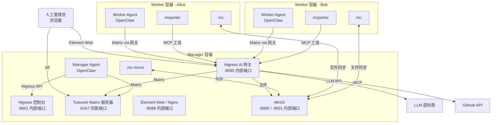

# HiClaw 架构说明

## 系统概览

HiClaw 是一个 Agent 团队系统，让多个 AI Agent 通过即时通讯（Matrix 协议）在人工监督下协同工作。



## 组件详解

### AI 网关（Higress）

Higress 作为所有外部访问的统一入口：

| 端口 | 服务 | 用途 |
|------|------|------|
| 8080 | 网关 | 所有基于域名路由的反向代理（宿主机默认暴露为 18080） |
| 8001 | 控制台 | 管理 API（Session Cookie 认证，宿主机默认暴露为 18001） |

**已配置的路由：**
- `matrix-local.hiclaw.io` -> Tuwunel（端口 6167）- Matrix 服务器
- `matrix-client-local.hiclaw.io` -> Element Web（端口 8088）- IM Web 客户端
- `fs-local.hiclaw.io` -> MinIO（端口 9000）- HTTP 文件系统（需认证）
- `aigw-local.hiclaw.io` -> AI 网关 - LLM 代理 + MCP 服务器（需认证）

> 所有基于域名的路由都通过网关的 8080 端口（宿主机：18080）。Element Web 也可通过宿主机 18088 端口直接访问（映射到容器内 8088 端口）。

### Matrix 服务器（Tuwunel）

Tuwunel 是高性能 Matrix 服务器（conduwuit 的 fork）：
- 运行在 6167 端口
- 管理人工管理员、Manager 和 Worker 之间的所有 IM 通信
- 使用 `CONDUWUIT_` 环境变量前缀
- 支持单步注册（使用 token，无需 UIAA 流程）

### HTTP 文件系统（MinIO）

MinIO 提供可通过 HTTP 访问的集中式文件存储：
- 9000 端口（API）和 9001 端口（控制台）
- `mc mirror --watch` 提供实时本地 ↔ 远端双向同步
- 所有 Agent 配置、任务说明和结果均存储于此

### Manager Agent（OpenClaw）

Manager Agent 负责协调整个团队：
- 通过 Matrix 私信**或其他已配置的渠道**（Discord、飞书、Telegram 等）接收人工管理员的任务
- 创建 Worker（Matrix 账号 + Higress Consumer + 配置文件）
- 分配和跟踪任务
- 执行心跳检查（由 OpenClaw 内置心跳机制触发）
- 管理凭据和访问控制
- 自动停止空闲 Worker 容器，并在分配任务时自动重启
- 监控 Matrix 房间会话过期，按需发送保活消息
- 将每日通知路由到管理员的**主渠道**（Matrix 私信作为备用）
- 支持**跨渠道升级**：将紧急问题发送到管理员的主渠道，并将回复路由回原始 Matrix 房间

### Worker Agent（OpenClaw）

Worker 是轻量级、无状态的容器：
- 启动时从 MinIO 拉取所有配置
- 通过 Matrix 房间通信（每个房间包含人工管理员 + Manager + Worker）
- 使用 mcporter CLI 调用 MCP Server 工具（GitHub 等）
- 可随时销毁和重建，不会丢失状态
- Manager 可通过宿主机容器运行时 socket（Docker/Podman）直接创建 Worker，或提供 `docker run` 命令用于手动/远程部署

## 安全模型

```
┌──────────────────────────────────────┐
│            Higress 网关              │
│   Consumer key-auth（BEARER token）  │
│                                      │
│  manager: 完全访问权限               │
│  worker-alice: AI + FS + MCP(github) │
│  worker-bob:   AI + FS              │
└──────────────────────────────────────┘
```

- 每个 Worker 拥有唯一的 Consumer 和 key-auth BEARER token
- Manager 控制每个 Worker 可访问的路由和 MCP Server
- 外部 API 凭据（GitHub PAT 等）集中存储在 MCP Server 配置中
- Worker 永远无法直接看到外部 API 凭据

## 通信模型

所有通信都在 Matrix 房间中进行，支持人工监督（Human-in-the-Loop）：

```
房间："Worker: Alice"
├── 成员：@admin、@manager、@alice
├── Manager 分配任务 -> 所有人可见
├── Alice 汇报进度 -> 所有人可见
├── 人工管理员随时可以介入 -> 所有人可见
└── Manager 和 Worker 之间没有隐藏通信
```

## 文件系统布局

### Manager 工作空间（仅本地，可挂载到宿主机）

Manager 的工作目录存在于宿主机上，以 bind mount 方式挂载到容器中，不会同步到 MinIO。

- **宿主机默认路径**：`~/hiclaw-manager`（安装时可通过 `HICLAW_WORKSPACE_DIR` 配置）
- **容器内路径**：`/root/manager-workspace`（作为 Manager Agent 进程的 `HOME`，`~` 指向此处）

```
~/hiclaw-manager/            # 宿主机路径（bind mount 到容器内 /root/manager-workspace，即 Agent 的 HOME）
├── SOUL.md                  # Manager 身份（首次启动时从镜像复制）
├── AGENTS.md                # 工作空间指南
├── HEARTBEAT.md             # 心跳检查清单
├── openclaw.json            # 生成的配置（每次启动时重新生成）
├── skills/                  # Manager 自身的技能
├── worker-skills/           # Worker 技能定义（通过 mc cp 推送给 Worker）
├── workers-registry.json    # Worker 技能分配和房间 ID
├── state.json               # 活跃任务状态
├── worker-lifecycle.json    # Worker 容器状态和空闲跟踪
├── primary-channel.json     # 管理员首选的主通知渠道
├── trusted-contacts.json    # 允许与 Manager 对话的非管理员联系人
├── coding-cli-config.json   # 编码 CLI 委托配置（是否启用、CLI 工具名称）
├── yolo-mode                # 存在时启用 YOLO 模式（自主决策，无需管理员确认）
├── .session-scan-last-run   # 上次 Matrix 会话过期扫描的时间戳
└── memory/                  # Manager 的记忆文件（MEMORY.md、YYYY-MM-DD.md）
```

### MinIO 对象存储（Manager 和 Worker 共享）

通过 `mc mirror` 同步到 Manager 侧的 `~/hiclaw-fs/`。

```
MinIO bucket: hiclaw-storage/   （镜像到 Manager 的 ~/hiclaw-fs/）
├── agents/
│   ├── alice/           # Worker Alice 配置
│   │   ├── SOUL.md
│   │   ├── openclaw.json
│   │   ├── skills/
│   │   └── mcporter-servers.json
│   └── bob/             # Worker Bob 配置
├── shared/
│   ├── tasks/           # 任务规格、元数据和结果
│   │   └── task-{id}/
│   │       ├── meta.json    # 任务元数据（assigned_to、status、时间戳）
│   │       ├── spec.md      # 完整任务规格（由 Manager 编写）
│   │       ├── base/        # Manager 维护的参考文件（代码库、文档等）
│   │       └── result.md    # 任务结果（由 Worker 编写）
│   └── knowledge/       # 共享参考资料
└── workers/             # Worker 工作产出
```
